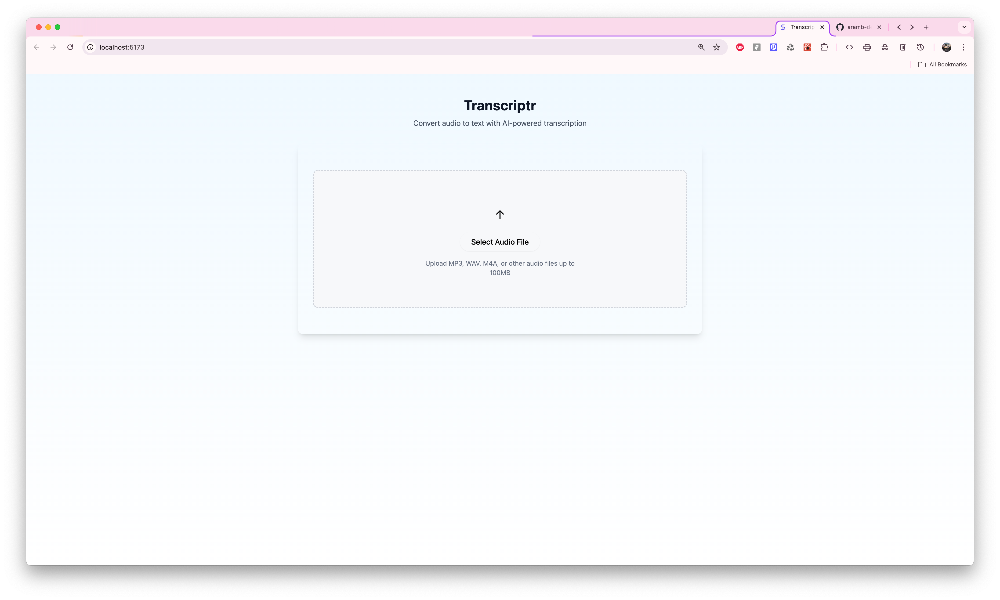

Collecting workspace information# Transcriptr - AI-Powered Audio Transcription

Transcriptr is a modern web application that converts audio files to text using artificial intelligence. It provides a clean, intuitive interface for uploading audio files and receiving high-quality transcriptions powered by Replicate's Incredibly Fast Whisper model.



## Features

- **Audio Transcription**: Convert audio to text with high accuracy
- **Multiple Format Support**: Download transcriptions in TXT, MD, PDF, and DOCX formats
- **Language Selection**: Choose from multiple languages for better accuracy
- **Speaker Diarization**: Optionally identify different speakers in the transcription
- **Batch Processing**: Handle large files efficiently with optimized processing
- **Export Options**: Download individual formats or all formats as a ZIP

## Technology Stack

- **Frontend**: React with TypeScript, powered by Vite for fast development
- **UI**: Tailwind CSS with shadcn/ui components for a modern interface
- **Backend**: Express.js server for handling API requests
- **AI Integration**: Replicate API for accessing the Incredibly Fast Whisper model
- **Document Handling**: Libraries for generating PDF, DOCX, and ZIP files

## Getting Started

### Prerequisites

- Node.js (v16 or later)
- npm or yarn
- Replicate API token (for AI transcription)

### Installation

1. Clone the repository:

   ```bash
   git clone https://github.com/yourusername/transcriptr.git
   cd transcriptr
   ```

2. Install dependencies:

   ```bash
   npm install
   ```

3. Create a .env file in the root directory with your Replicate API token:

   ```
   VITE_REPLICATE_API_TOKEN=your_replicate_api_token_here
   ```

4. Start the development server:

   ```bash
   npm run dev
   ```

5. Open your browser to `http://localhost:5173` to see the application.

## Build and Deployment

### Building for Production

To build the application for production:

```bash
npm run build
```

This command creates optimized production builds for both client and server:

- Client files are generated in `dist/client`
- Server files are generated in server

### Deploying to Production

1. Build the application as described above
2. Set the environment variable `NODE_ENV` to `production`
3. Start the server:
   ```bash
   npm run start
   ```

The server will run on port 3001 by default, but you can override this by setting the `PORT` environment variable.

### Docker Deployment (Optional)

Create a Dockerfile in the root directory:

```dockerfile
FROM node:18-alpine

WORKDIR /app

COPY package*.json ./
RUN npm install

COPY . .
RUN npm run build

ENV NODE_ENV=production
ENV PORT=3001

EXPOSE 3001

CMD ["npm", "run", "start"]
```

Build and run the Docker container:

```bash
docker build -t transcriptr .
docker run -p 3001:3001 -e VITE_REPLICATE_API_TOKEN=your_token_here transcriptr
```

## Project Structure

```
transcriptr/
├── public/                # Static assets
├── src/                   # Source code
│   ├── assets/            # Images and other assets
│   ├── components/        # React components
│   │   ├── ui/            # UI components based on shadcn/ui
│   │   ├── TranscriptionOptions.tsx  # Language and diarization options
│   │   ├── TranscriptionResult.tsx   # Display and download results
│   │   └── UploadAudio.tsx           # File upload component
│   ├── hooks/             # Custom React hooks
│   ├── lib/               # Utility functions
│   ├── server/            # Express server for API handling
│   ├── App.tsx            # Main application component
│   ├── index.css          # Global CSS
│   └── main.tsx           # Entry point
├── index.html             # HTML template
├── tailwind.config.js     # Tailwind CSS configuration
├── tsconfig.json          # TypeScript configuration
├── vite.config.ts         # Vite configuration
└── package.json           # Dependencies and scripts
```

## API Documentation

### `/api/transcribe`

**Method**: POST

**Description**: Upload an audio file for transcription

**Request Body**:

```json
{
  "audioData": "base64-encoded-audio-data",
  "options": {
    "modelId": "vaibhavs10/incredibly-fast-whisper:3ab86df6c8f54c11309d4d1f930ac292bad43ace52d10c80d87eb258b3c9f79c",
    "task": "transcribe",
    "batch_size": 64,
    "return_timestamps": true,
    "language": "english", // Optional, for better accuracy
    "diarize": false // Optional, for speaker identification
  }
}
```

**Response**: JSON object with prediction ID or immediate transcription

### `/api/prediction/:id`

**Method**: GET

**Description**: Check the status of a transcription in progress

**Parameters**:

- `id`: The prediction ID returned from the transcribe endpoint

**Response**: JSON object with prediction status and results (if complete)

## Contributing

Contributions are welcome! Please feel free to submit a Pull Request.

1. Fork the repository
2. Create your feature branch (`git checkout -b feature/AmazingFeature`)
3. Commit your changes (`git commit -m 'Add some AmazingFeature'`)
4. Push to the branch (`git push origin feature/AmazingFeature`)
5. Open a Pull Request

## License

This project is licensed under the MIT License - see the LICENSE file for details.

## Acknowledgements

- [Replicate](https://replicate.com/) for providing the Incredibly Fast Whisper model
- [shadcn/ui](https://ui.shadcn.com/) for the component library
- [Tailwind CSS](https://tailwindcss.com/) for styling
- [React](https://reactjs.org/) for the UI framework
- [Vite](https://vitejs.dev/) for the build tool

---

Developed by [Abdur-Rahman Bilal (aramb-dev)](https://github.com/aramb-dev)
