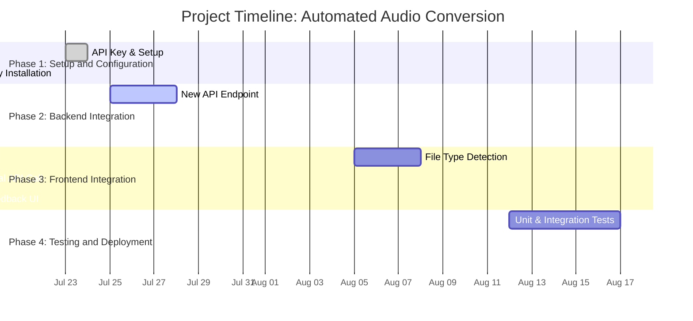

# Project: Automated Audio Conversion for Transcription Service

## 1. Executive Summary

This document outlines a plan to implement an automated audio conversion workflow for the Replicate transcription service. The project's primary purpose is to expand the range of supported audio formats by integrating CloudConvert to automatically convert unsupported files (e.g., M4A, AAC) into the universally compatible MP3 format. This will enhance user experience by preventing upload failures and seamlessly integrating with the existing transcription pipeline, ensuring all uploaded audio is processed successfully.

## 2. Problem Statement

The Replicate transcription service only natively supports a limited set of audio formats (MP3, WAV, FLAC, OGG). However, users frequently possess audio files in other common formats, such as M4A from iPhone recordings or audio extracted from MP4 videos. Uploading any of these unsupported formats results in transcription failure, creating a poor and frustrating user experience. To solve this, a robust mechanism is needed to standardize all incoming audio into a format that Replicate is guaranteed to understand.

## 3. Proposed Solution

The proposed solution is to implement an automated conversion workflow using the CloudConvert API. This workflow will trigger in the background after a user uploads an unsupported file format. The process consists of a multi-step CloudConvert "job":

1.  **Import File:** CloudConvert fetches the user's original audio file from its storage URL.
2.  **Convert to MP3:** The imported file is converted into the MP3 format.
3.  **Export New File:** CloudConvert generates a temporary, public URL for the newly created MP3 file.

The backend application will then use this new export URL to send the converted MP3 file to the Replicate service for transcription. This ensures that regardless of the original audio format, the transcription service always receives a compatible file.

## 4. Project Goals and Objectives

- **Increase Supported Formats:** Significantly expand the variety of audio file types the service can accept from users.
- **Improve User Experience:** Eliminate transcription failures caused by unsupported formats, providing a more reliable and seamless user journey.
- **Ensure Seamless Integration:** Integrate the CloudConvert workflow smoothly into the existing backend and transcription process with minimal disruption.
- **Automate the Workflow:** Create a fully automated, background process that requires no manual intervention from the user or administrators.

## 5. Project Phases and Implementation Details

### Phase 1: Setup and Configuration

The initial phase involves preparing the development environment and integrating the CloudConvert service.

1.  **API Key Acquisition:** Obtain a new API key from the CloudConvert dashboard.
2.  **Environment Variable Setup:** Store the API key securely in the project's environment variables (`.env.local` for development and the hosting provider's secret store for production) under the name `CLOUDCONVERT_API_KEY`.
3.  **Dependency Installation:** Add the official CloudConvert Node.js library to the project by running `npm install cloudconvert`.

### Phase 2: Backend Integration

This phase focuses on creating the core logic that handles the file conversion process.

1.  **New API Endpoint:** A new API route will be created at `src/app/api/convert/cloud/route.ts`.
2.  **Conversion Logic:** This endpoint will accept a request containing the public URL of the user's uploaded audio file.
3.  **CloudConvert Job:** Using the `cloudconvert` library, the endpoint will dynamically create a new conversion job. The job will consist of three sequential tasks:
    - An `import/url` task to fetch the original audio file.
    - A `convert` task to transform the imported file into MP3 format.
    - An `export/url` task to generate a temporary public URL for the resulting MP3 file.
4.  **Transcription Trigger:** Once the conversion job is complete and the new MP3 URL is retrieved, the backend will pass this URL to the existing Replicate transcription service, seamlessly continuing the transcription pipeline.

### Phase 3: Frontend Integration

The client-side application will be updated to intelligently route file uploads to the appropriate backend endpoint.

1.  **File Type Detection:** The existing file upload component (`src/components/transcription/FileUploadInput.tsx`) will be modified to include logic that inspects the file extension (`.m4a`, `.aac`, `.mp4`, etc.) of the user's selected file.
2.  **Conditional API Call:**
    - If the file format is natively supported (e.g., MP3, WAV), the application will proceed to call the standard transcription endpoint (`/api/transcribe`).
    - If the file format is unsupported, the application will instead call the new conversion endpoint (`/api/convert/cloud`) and pass the file's URL.
3.  **User Feedback:** The UI will provide clear feedback about the conversion process:
    - Show a "Converting audio file..." state when unsupported files are being processed
    - Display progress indicators during the conversion phase
    - Transition to "Transcribing..." once the file has been converted and sent to Replicate
    - This transparency helps manage user expectations about longer processing times

### Phase 4: Testing and Deployment

A comprehensive testing strategy will be implemented to ensure the new workflow is robust and reliable.

1.  **Unit Testing:** Write unit tests for the new `/api/convert/cloud` endpoint to validate its logic in isolation.
2.  **Integration Testing:** Create integration tests to verify that the frontend correctly identifies and sends unsupported files to the conversion endpoint and that the backend successfully processes them and initiates transcription.
3.  **End-to-End (E2E) Testing:** Perform manual E2E tests by uploading a variety of unsupported audio formats (M4A, AAC, MP4) to the application to confirm the entire workflow functions as expected.
4.  **Deployment:** After all tests pass, the code will be merged into the main branch and deployed to production. The `CLOUDCONVERT_API_KEY` environment variable will be configured in the production environment.

## 6. Process Flowchart

```mermaid
graph TD
    A[User Uploads Audio File] --> B{Check File Format};
    B -->|Supported Format (MP3, WAV)| C[Send to Replicate for Transcription];
    B -->|Unsupported Format (M4A, AAC)| D[Call Conversion API /api/convert/cloud];
    D --> E[CloudConvert Job: Import -> Convert to MP3 -> Export URL];
    E --> F[Get Temporary MP3 URL];
    F --> C;
    C --> G[Return Transcription to User];
```

## 7. Resource Allocation

| Resource Category       | Item                      | Description                                                         | Estimated Cost/Effort                   |
| :---------------------- | :------------------------ | :------------------------------------------------------------------ | :-------------------------------------- |
| **Human Resources**     | Backend Developer         | Responsible for API endpoint creation and CloudConvert integration. | 20-30 hours                             |
|                         | Frontend Developer        | Responsible for file type detection and conditional API logic.      | 15-20 hours                             |
|                         | QA Engineer               | Responsible for unit, integration, and E2E testing.                 | 10-15 hours                             |
|                         | Project Manager           | Oversees project execution, timeline, and communication.            | 5-10 hours                              |
| **Technical Resources** | CloudConvert API          | Service for handling audio file conversions.                        | Subscription-based (dependent on usage) |
|                         | Development Environment   | Local machines with Node.js and necessary dependencies.             | Existing                                |
|                         | Production Hosting        | Vercel or similar platform for deployment.                          | Existing                                |
|                         | Version Control           | GitHub repository for code management.                              | Existing                                |
| **Financial Resources** | CloudConvert Subscription | Monthly or annual fee for API access.                               | ~$20/month (estimate)                   |
|                         | Developer Salaries        | Compensation for the development team's time.                       | Internal Cost                           |

## 8. Project Timeline



## 9. Risk Management

| Risk ID  | Anomaly / Risk Description                                                                                          | Likelihood | Impact | Mitigation Strategy                                                                                                                                                                                                                       |
| :------- | :------------------------------------------------------------------------------------------------------------------ | :--------- | :----- | :---------------------------------------------------------------------------------------------------------------------------------------------------------------------------------------------------------------------------------------- |
| **R-01** | **CloudConvert API Unavailability:** The external API service experiences downtime, preventing file conversions.    | Low        | High   | Implement a fallback mechanism that informs the user of the temporary issue and suggests retrying later. Monitor CloudConvert's status page.                                                                                              |
| **R-02** | **API Key Leakage:** The `CLOUDCONVERT_API_KEY` is accidentally exposed in client-side code or public repositories. | Medium     | High   | Store the API key exclusively in secure environment variables (`.env.local` and production secrets). Implement regular key rotation and repository scanning for secrets.                                                                  |
| **R-03** | **Conversion Failures:** A specific audio file is corrupt or in a format that even CloudConvert cannot process.     | Low        | Medium | Implement robust error handling in the `/api/convert/cloud` endpoint to catch job failures. Log the failed job details and return a clear error message to the user.                                                                      |
| **R-04** | **Increased Latency:** The conversion process adds noticeable delay to the user's transcription request time.       | Medium     | Medium | Optimize the CloudConvert job by selecting the nearest processing region. Inform the user that their file is "processing" to manage expectations. For very large files, consider a webhook-based approach instead of synchronous polling. |
| **R-05** | **Cost Overruns:** Higher-than-expected usage of the CloudConvert API leads to exceeding budget.                    | Medium     | Low    | Set up billing alerts and usage quotas in the CloudConvert dashboard. Regularly review API usage logs to monitor consumption patterns and optimize if necessary.                                                                          |
